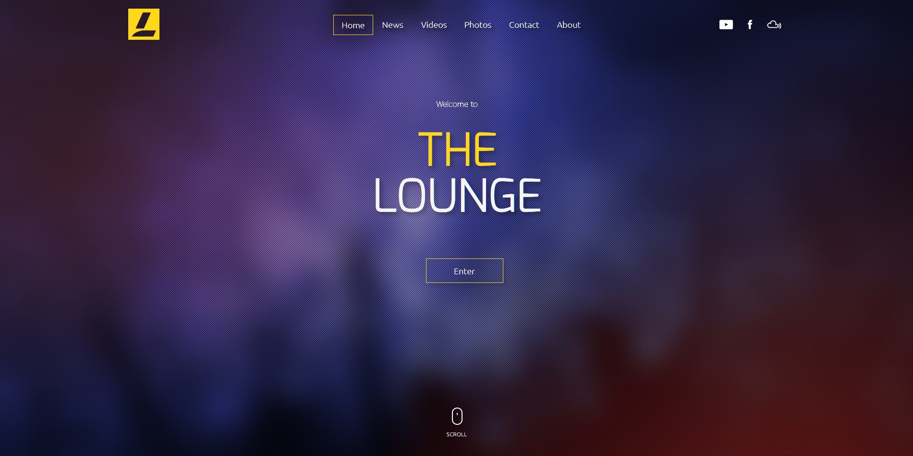
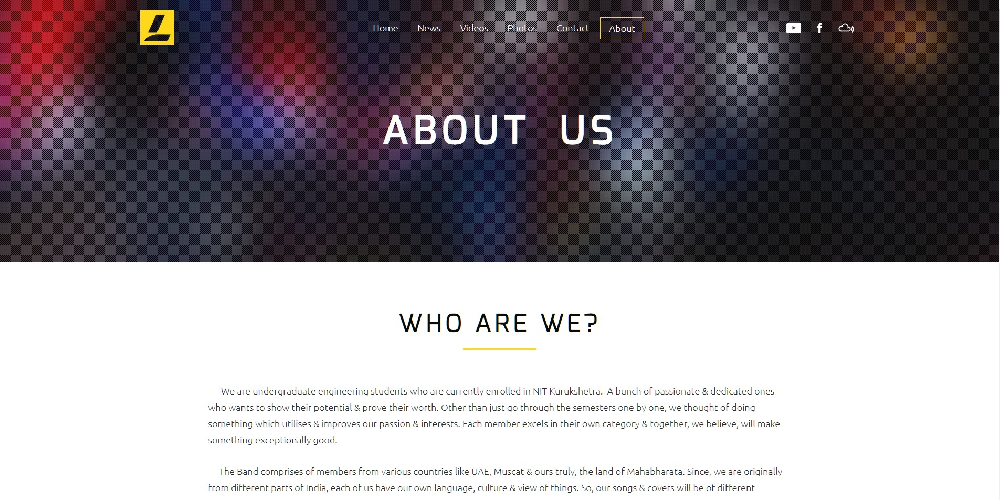
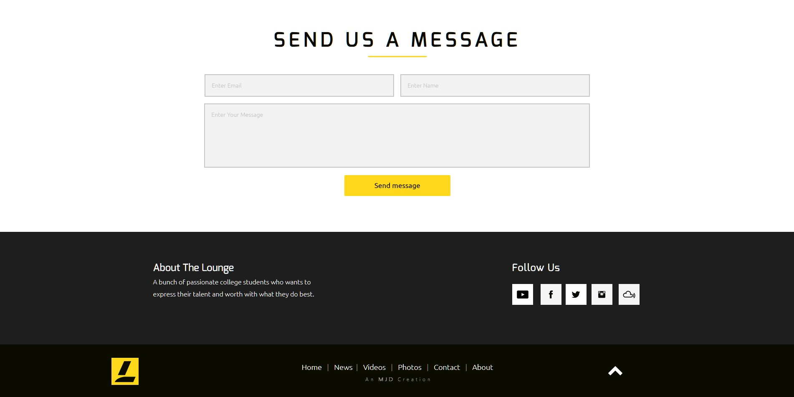

# The Lounge Band
An elegant & Minimal website made with **Adobe Muse** for a college Musical Band while pursuing my Undergraduate in B.Tech

The website aimed at ease of use & navigation for our dearest viewers and to present the relevant information as easily and as straight forward as possible, whilst maintaining the latest design languages and practices.

Here is a short teaser to the website. *(I know I was super excited then that I even made a video on a website xD)*

[https://www.youtube.com/watch?v=BEe9PPk9HLg](https://www.youtube.com/watch?v=BEe9PPk9HLg "https://www.youtube.com/watch?v=BEe9PPk9HLg")

### Snaps from Website

  > Welcome Screen

  > About Page with the ecessary details presented in a clean manner
  
  

  > Parrallax scrolling effect with careful selection
  
  

  > Contact Page
  

###### Although the band got dismissed after the first trailer *(due to reasons unforeseen)*, **I thought it would be best to showcase this now than to just let it go waste**
